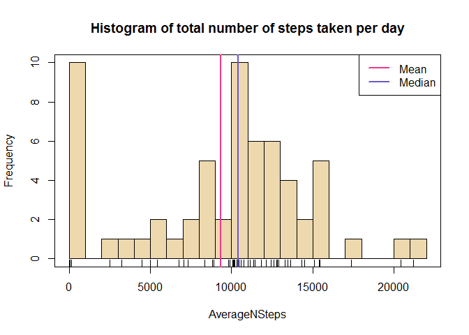
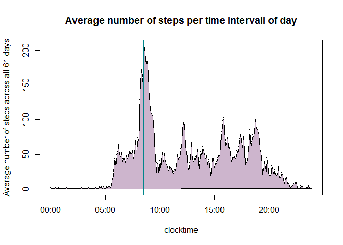
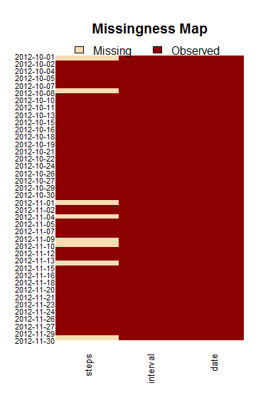
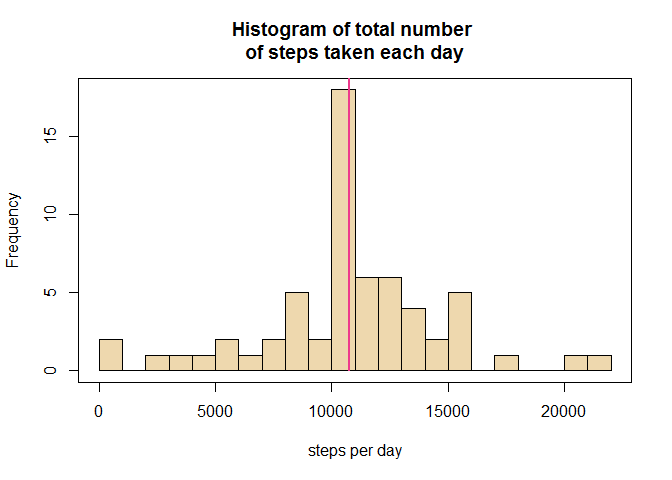
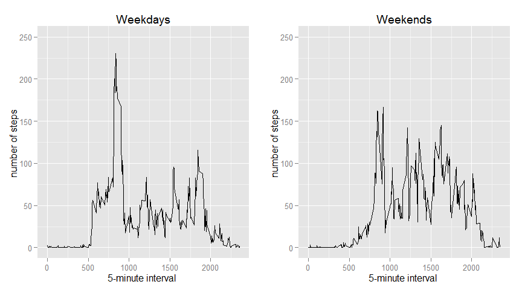

# Reproducible Research: Peer Assessment 1

<hr />
## Loading and preprocessing the data
<hr />

This is an analysis of data from a personal activity monitoring device. Data was collected at 5 minute intervals throughout the day, from 01.10.2012 until 30.11.2012. 


```r
require(markdown)
require(knitr)  
require(xtable) # install.packages('xtable')
require(Amelia) # install.packages('Amelia')
```

```
## Warning: package 'Amelia' was built under R version 3.1.2
## Warning: package 'RcppArmadillo' was built under R version 3.1.2
```

```r
library(ggplot2)
require(gridExtra)  # install.packages('gridExtra')
```

```
## Warning: package 'gridExtra' was built under R version 3.1.2
```

```r
unzip(zipfile="activity.zip")
data <- read.csv("activity.csv")
#data <- read.csv("activity.csv", stringsAsFactors = FALSE)
head(data); dim(data)
```

```
##   steps       date interval
## 1    NA 2012-10-01        0
## 2    NA 2012-10-01        5
## 3    NA 2012-10-01       10
## 4    NA 2012-10-01       15
## 5    NA 2012-10-01       20
## 6    NA 2012-10-01       25
```

```
## [1] 17568     3
```


## What is mean total number of steps taken per day?

As the first step, the total number of steps for each of the 61 days is calculated.


```r
ag <- aggregate(data$steps, by=list(date=data$date), function(x) sum(x, na.rm=TRUE))
head(ag) 
```

```
##         date     x
## 1 2012-10-01     0
## 2 2012-10-02   126
## 3 2012-10-03 11352
## 4 2012-10-04 12116
## 5 2012-10-05 13294
## 6 2012-10-06 15420
```

```r
colnames(ag)[2]<- "AverageNSteps"
## Histogram
with(ag, hist(AverageNSteps, breaks=20,  col='wheat2', main="Histogram of total number of steps taken per day"))
mu <- mean(ag$AverageNSteps); med <- median(ag$AverageNSteps)
rug(ag$AverageNSteps) ; box()
abline(v=c(mu, med), col=c("violetred2","slateblue3" ), lwd=2.5)
legend("topright", c("Mean", "Median"), col=c("violetred2","slateblue3" ), lwd=2.5)
```

 

```r
stats <- data.frame(Statistics=c(mu,med)); rownames(stats)<-c("Mean", "Median")
meanstab <- xtable(stats)
```
From the histogram it can be seen that the observed individual took on average around 10000 steps per day.
<center>

```r
print(meanstab, type='html')
```

<!-- html table generated in R 3.1.1 by xtable 1.7-4 package -->
<!-- Sun Nov 16 21:54:58 2014 -->
<table border=1>
<tr> <th>  </th> <th> Statistics </th>  </tr>
  <tr> <td align="right"> Mean </td> <td align="right"> 9354.23 </td> </tr>
  <tr> <td align="right"> Median </td> <td align="right"> 10395.00 </td> </tr>
   </table>
</center>


## What is the average daily activity pattern?


For each of the 61 days there are 288 unique time intervall identifiers, that is 24h*60min/5min=288. Aggregating the number of steps accross different days for a certain intervall leads to the graphic below.


```r
ag2 <- aggregate(data$steps, by=list(interval=data$interval), function(x) mean(x, na.rm=TRUE))
head(ag2)
```

```
##   interval       x
## 1        0 1.71698
## 2        5 0.33962
## 3       10 0.13208
## 4       15 0.15094
## 5       20 0.07547
## 6       25 2.09434
```

```r
clocktime<-  as.character(ag2$interval)
w <- which(nchar(clocktime)<4)
zeros <- lapply(sapply( 4-nchar(clocktime[w]), function(x) rep("0",x)), function(x)paste(x, collapse=""))
clocktime[w] <- paste( as.character(zeros)  , clocktime[w], sep="")

minutes <- as.POSIXct(clocktime, "%H%M", origin="2012-10-01", tz="UTC") # origin and timezone are not relevant, just for getting nice clocktime
ag2$minutes <- format(minutes, "%H:%M")
plot(minutes, ag2$x, type='b', ylab="Average number of steps across all 61 days", main="Average number of steps per time intervall of day",  pch=20,cex=0.5, lty=1, xlab="clocktime")
xx <- c(minutes, min(minutes)) ; yy <- c(ag2$x,0)
polygon(xx, yy, col="thistle3")  
abline(v=minutes[which(ag2$x==max(ag2$x))], col='turquoise4', lwd=2)
```

 

```r
 ag2[which(ag2$x==max(ag2$x)),3]
```

```
## [1] "08:35"
```

On average, the time interval __08:35__ contained the maximum number of steps.


## Imputing missing values

As a first step the __missmap__ function from the Amelia package was used to get a first look on the missingness structure in the data.

<center>

```r
nas <- apply(data, 1, function(x) sum(is.na(x))); 
nas <- factor(nas, levels=0:1, labels=c("observed values", "missing values")) 
missmap(data, tsvar=date, y.labels=data$date[seq(1,17568, length.out=40)], y.at= seq(1,17568, length.out=40), y.cex=0.7)
```

 

```r
NAtable <- xtable(table(number_of_NAs=nas), align="c|c", digits=30)
```
</center>

There are several days without observations. For these the missing values are coded as NA. Both ignoring and imputing the missing values for these days may introduce bias into some calculations of the data.

The total number of missing values in the dataset can be found in the next table. 

<center>

```r
print(NAtable, type='html', width=300)
```

<!-- html table generated in R 3.1.1 by xtable 1.7-4 package -->
<!-- Sun Nov 16 21:54:59 2014 -->
<table border=1>
<tr> <th>  </th> <th> number_of_NAs </th>  </tr>
  <tr> <td align="center"> observed values </td> <td align="center">                           15264 </td> </tr>
  <tr> <td align="center"> missing values </td> <td align="center">                            2304 </td> </tr>
   </table>
</center>
On 8 days the weren't made any observations and all values during the days are missing.
The missing values are replaced by the mean values.


```r
nas <- tapply(data$steps, as.Date(data$date), function(x) sum(is.na(x)))
data2 <- data
fiveminutesMeans <- aggregate(data$steps, by=list( data$interval), function(x) mean(x, na.rm=TRUE))
days <- names(nas[nas!=0])
for(j in 1:length(days)){
  data2[data2$date %in% days[j],1] <- fiveminutesMeans$x
  }
## Now the missing values are gone, for each days the is 0 NA's:
nas2 <- tapply(data2$steps, as.Date(data2$date), function(x) sum(is.na(x)))
perday <- aggregate(data2$steps, by=list(data2$date), sum) 
```


A new data frame was created in which the missing values are replaced with the mean for the 5-minute interval. After that the mean and median of the total number of steps taken per day equal both 10766.


```r
hist(perday[,2],breaks=20,  main="Histogram of total number \nof steps taken each day", col='wheat2', xlab="steps per day")
box()
lines(c(mean(perday$x), median(perday$x) ),c(0,24), col=c("violetred2","slateblue3" ), lwd=2.5)
```

 

```r
mean(perday$x)
```

```
## [1] 10766
```

```r
median(perday$x) 
```

```
## [1] 10766
```

Now the values for mean/median total number of steps per day differ from the estimates without imputation. A large number of values was set at the mean therefore the median and the mean got close. The impact of imputing missing data with mean values is that the mean and the median become equal.

## Are there differences in activity patterns between weekdays and weekends?

The last analysis regards activity patterns in connection with days of the week.


```r
weekday <- weekdays(as.Date(data$date), abbreviate=TRUE)
weekday <- as.numeric(weekday %in% c("Sa","So")) 
data2$weekday <- factor(weekday, levels=0:1, labels=c("weekday", "weekend"))
table(data2$weekday)
```

```
## 
## weekday weekend 
##   12960    4608
```

```r
ag3 <- aggregate(data2$steps, by=list(interval=data2$interval, week=data2$weekday),   mean )


plot1 <- qplot(interval, x, data=ag3[ag3$week=="weekday",],   main="Weekdays", ylim=c(0,250), geom="line")+ labs(x = "5-minute interval ", y = "number of steps ")
plot2 <- qplot(interval, x, data=ag3[ag3$week=="weekend",] , main="Weekends",ylim=c(0,250), geom="line")+ 
    labs(x = "5-minute interval ", y = "number of steps ")
grid.arrange(plot1, plot2, ncol=2)
```

 

From the graphs above it can be seen that the activity pattern differs between weekdays and weekends. Perhaps the observed individual is running in the morning on weekdays but not on weekends. On the other side, more movement is obbserved on weekends in the course of the day.  
